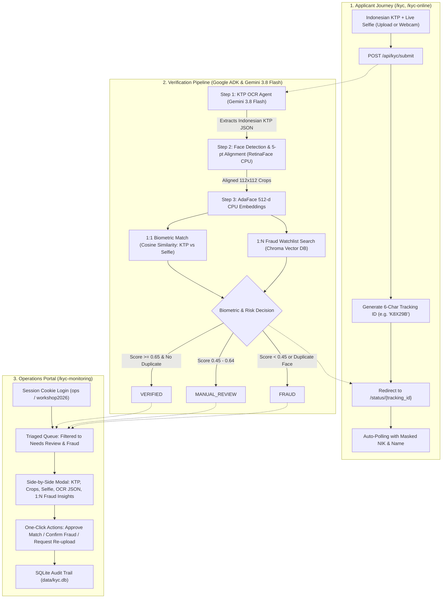

# AGY-KYC Checker 🇮🇩

[](https://www.python.org/)
[](https://github.com/google/adk)
[-orange.svg)](https://cloud.google.com/vertex-ai)
[-green.svg)](https://github.com/mk-minchul/AdaFace)
[](https://www.trychroma.com/)
[](https://fastapi.tiangolo.com/)

**AGY-KYC Checker** is an end-to-end, enterprise-grade Indonesian e-KYC (Know Your Customer) demonstration application built for the **Antigravity AI Workshop 2026**.

The system combines **Google ADK (Agent Development Kit)** and **Gemini 3.8 Flash** for Indonesian Identity Card (KTP) OCR extraction with high-speed **AdaFace ONNX CPU biometrics** and **Chroma Vector DB** to deliver 1:1 facial verification and 1:N duplicate identity fraud detection.

---

## 📌 Architecture Overview



---

## 🚀 Key Features

- **🇮🇩 Indonesian e-KTP Intelligent Extraction**: Uses Gemini 3.8 Flash via Vertex AI to extract standard fields into structured JSON (`NIK`, `Nama`, `Tempat/Tgl Lahir`, `Jenis Kelamin`, `Alamat`, `RT/RW`, `Kel/Desa`, `Kecamatan`, `Agama`, `Status Perkawinan`, `Pekerjaan`, `Kewarganegaraan`, `Berlaku Hingga`).
- **⚡ High-Speed CPU Face Recognition (AdaFace + RetinaFace)**: Runs 5-point facial landmark alignment and 512-dimensional AdaFace facial embedding extraction entirely on CPU via ONNX Runtime without heavy GPU requirements.
- **🛡️ Dual Biometric Defense**:
  - **1:1 Facial Match**: Cosine similarity between KTP photo and live selfie.
  - **1:N Vector Sybil / Fraud Detection**: Chroma Vector DB checks if an applicant's face is already registered under a different NIK or identity.
- **🌐 Modern FastAPI Web Endpoints**:
  - `/kyc`: Public applicant interface with responsive drag-and-drop file uploaders for KTP and selfie.
  - `/status/{tracking_id}`: Dedicated tracking page with live status polling (2.5s) and privacy-first masked identity fields (`317202******0001`).
  - `/kyc-monitoring`: Operations dashboard protected by session authentication with triaged review queues (`MANUAL_REVIEW`, `FRAUD`), side-by-side biometric comparison, and 1-click decision actions.
- **🗄️ Hybrid Storage Architecture**:
  - **SQLite** (`data/kyc.db`): Transactional state, applicant metadata, full OCR JSON, file paths, and ops audit trails.
  - **Chroma** (`data/chroma/`): 512-d biometric vector collection for instant vector similarity and duplicate identity lookups.
- **☁️ Cloud Run & Cloud Build Ready**: Multi-stage `Dockerfile` and parameterized `cloudbuild.yaml` targeting Google Cloud Run in `asia-southeast2` (Jakarta) or any custom region.

---

## 📂 Repository Structure

```text
.
├── .python-version               # Pinned to Python 3.13
├── pyproject.toml                # uv & pip dependencies
├── Dockerfile                    # Multi-stage production container
├── cloudbuild.yaml               # Parameterized CI/CD for Cloud Build
├── .env.example                  # Environment configuration template
├── README.md                     # Workshop & project documentation
│
├── app/                          # Web Application Layer (FastAPI)
│   ├── main.py                   # FastAPI entrypoint & router mounts
│   ├── routes/
│   │   ├── kyc.py                # /kyc & /status/{id} endpoints
│   │   ├── ops.py                # /kyc-monitoring & review endpoints
│   │   └── auth.py               # Session login/logout endpoints
│   ├── templates/                # Responsive HTML templates with Tailwind CSS
│   │   ├── kyc.html              # Drag-and-drop applicant portal
│   │   ├── status.html           # Live polling status page
│   │   ├── monitoring.html       # Ops agent review dashboard
│   │   └── login.html            # Ops agent login page
│   └── static/                   # Icons, stylesheets, and client-side helpers
│
├── kyc_agent/                    # Google ADK Agent & AI Core
│   ├── __init__.py
│   ├── agent.py                  # Root ADK Agent definition
│   ├── ocr.py                    # Gemini 3.8 Flash KTP OCR engine
│   ├── biometrics.py             # RetinaFace + AdaFace ONNX CPU biometrics
│   ├── vectordb.py               # Chroma vector store (1:1 & 1:N matching)
│   ├── database.py               # SQLite persistence & audit log
│   └── cli.py                    # Terminal CLI runner with mock testing
│
├── tests/
│   ├── samples/                  # Mock Indonesian KTP & selfie images
│   └── test_pipeline.py          # End-to-end integration tests
│
└── data/                         # Local storage (gitignored)
    ├── uploads/                  # Uploaded KTP & selfie images
    ├── crops/                    # Extracted 112x112 face crops
    ├── kyc.db                    # SQLite database
    └── chroma/                   # Chroma vector database
```

---

## 🛠️ Getting Started (Local Development)

### 1. Prerequisites
- **Python 3.13** (managed seamlessly with [`uv`](https://docs.astral.sh/uv/))
- **Google Cloud SDK (`gcloud`)** authenticated for Vertex AI:
  ```bash
  gcloud auth application-default login
  ```

### 2. Installation with `uv`
Clone the repository and install all dependencies in a virtual environment:

```bash
# Clone the repository
git clone https://github.com/<your-username>/agy-workshop-kyc-checker.git
cd agy-workshop-kyc-checker

# Create virtual environment with Python 3.13 and install dependencies
uv venv --python 3.13
source .venv/bin/activate
uv pip install -e .
```

### 3. Environment Configuration
Copy the sample environment file and configure your credentials:

```bash
cp .env.example .env
```

Key environment variables:
```env
# Google Vertex AI Configuration
GOOGLE_GENAI_USE_VERTEXAI=1
GOOGLE_CLOUD_PROJECT=your-gcp-project-id
GOOGLE_CLOUD_LOCATION=global
MODEL_ID=gemini-3.8-flash

# Ops Agent Dashboard Credentials
OPS_USERNAME=ops
OPS_PASSWORD=workshop2026
SESSION_SECRET_KEY=secret-key-workshop-2026-secure-token

# Thresholds for Biometric Matching
BIOMETRIC_MATCH_THRESHOLD=0.65
BIOMETRIC_REVIEW_THRESHOLD=0.45
```

---

## 💻 Running the Application

### Option A: Run the FastAPI Web Application
Start the server with hot-reloading:

```bash
uv run uvicorn app.main:app --host 0.0.0.0 --port 8080 --reload
```
Open your browser:
- **Applicant Portal (Upload)**: `http://localhost:8080/kyc`
- **Applicant Portal (Live Webcam)**: `http://localhost:8080/kyc-online`
- **Ops Review Dashboard**: `http://localhost:8080/kyc-monitoring` (Login: `ops` / `workshop2026`)
- **Interactive API Docs**: `http://localhost:8080/docs`

### Option B: Run via Google ADK CLI
You can test the agent directly in terminal or launch the ADK Web Playground:

```bash
# Launch interactive terminal session
uv run adk run kyc_agent

# Launch ADK Web Visual Playground
uv run adk web kyc_agent
```

### Option C: Run the CLI Test Utility
Run the 3-step verification pipeline on mock test samples from the command line:

```bash
uv run python -m kyc_agent.cli --mock
```

---

## 🧪 Testing

Run automated end-to-end integration tests:

```bash
uv run pytest tests/
```

---

## ☁️ Google Cloud Build & Cloud Run Deployment

The repository includes a parameterized `cloudbuild.yaml` designed for Google Cloud Run:

```bash
# Submit build and deploy to Cloud Run in Jakarta (asia-southeast2)
gcloud builds submit \
  --project=your-gcp-project-id \
  --substitutions=_REGION=asia-southeast2,_SERVICE_NAME=agy-kyc-checker
```

Or deploy directly via `gcloud run deploy`:

```bash
gcloud run deploy agy-kyc-checker \
  --source . \
  --project your-gcp-project-id \
  --region asia-southeast2 \
  --allow-unauthenticated \
  --set-env-vars GOOGLE_GENAI_USE_VERTEXAI=1,GOOGLE_CLOUD_PROJECT=your-gcp-project-id,GOOGLE_CLOUD_LOCATION=global,MODEL_ID=gemini-3.8-flash
```

---

## 📄 License

Distributed under the Apache-2.0 License. See [LICENSE](LICENSE) for details.
